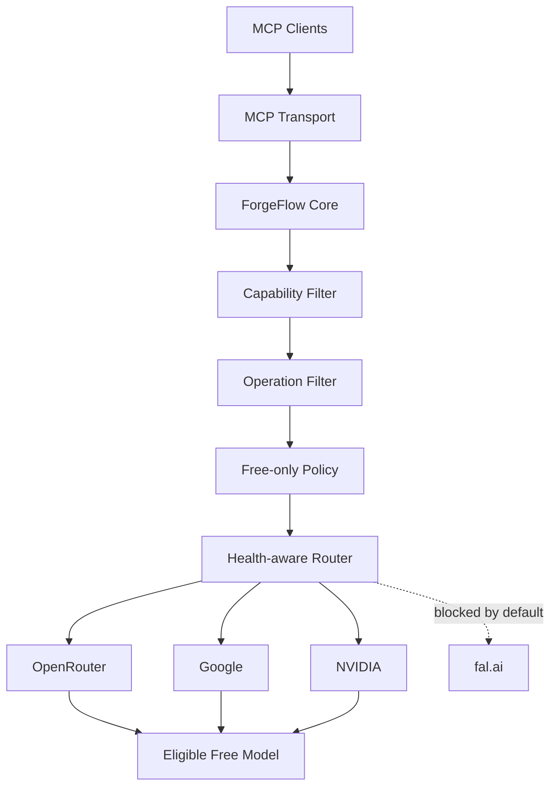

<div align="center">

# ForgeFlow MCP

### Universal AI orchestration for MCP

**Provider-agnostic · Free-first · Fail-closed · MCP-native**

[](https://www.npmjs.com/package/forgeflow-mcp)
[](https://github.com/Olympus-Interactive1/ForgeFlow-/actions)
[](https://github.com/Olympus-Interactive1/ForgeFlow-/releases)
[](https://nodejs.org/)
[](LICENSE)

<br />

**Route AI workloads across eligible providers without locking your MCP client to one vendor.**

ForgeFlow is designed to work with **OpenCode, Claude, Cursor, VS Code, custom MCP clients, and any other MCP-compatible host** through stdio or Streamable HTTP.

</div>

---

## Why ForgeFlow?

Most AI integrations hard-code a provider into the application. ForgeFlow puts a routing layer between the MCP client and the provider ecosystem.

```text
┌─────────────────────────────────────────────────────────────┐
│                        MCP CLIENTS                          │
│  OpenCode · Claude · Cursor · VS Code · Custom MCP Hosts    │
└────────────────────────────┬────────────────────────────────┘
                             │
                       MCP / stdio / HTTP
                             │
                             ▼
┌─────────────────────────────────────────────────────────────┐
│                         FORGEFLOW                           │
│                                                             │
│   Tools → Capability Filter → Operation Filter → Router     │
│                              │                              │
│                  Health / Latency / Fallback                │
│                              │                              │
│                     FREE-ONLY POLICY                        │
└────────────────────────────┬────────────────────────────────┘
                             │
              ┌──────────────┼──────────────┐
              ▼              ▼              ▼
         OpenRouter        Google         NVIDIA
              │              │              │
              └──────────────┼──────────────┘
                             ▼
                    Eligible free model

                 No silent paid fallback.
```

## ✦ What makes it different

| Capability | ForgeFlow |
|---|:---:|
| MCP-native | ✅ |
| Provider-agnostic | ✅ |
| Free-only mode | ✅ Default |
| User-owned API keys | ✅ |
| Capability-aware routing | ✅ |
| Operation-aware routing | ✅ |
| Health-aware fallback | ✅ |
| Silent paid fallback | ❌ |
| OpenCode lock-in | ❌ |
| Docker deployment | ✅ |
| Stdio + Streamable HTTP | ✅ |

> **Core rule:** when `FORGEFLOW_FREE_ONLY=true`, ForgeFlow will never silently route a request to a paid provider. If no eligible free path exists, it fails closed.

---

## ⚡ Quick start

### Install

```bash
npm install forgeflow-mcp
```

Or run directly:

```bash
npx forgeflow-mcp
```

### Configure your own keys

```env
FORGEFLOW_FREE_ONLY=true
FORGEFLOW_FREE_PROVIDERS=openrouter,google,nvidia

OPENROUTER_API_KEY=
GOOGLE_API_KEY=
NVIDIA_API_KEY=
```

You do **not** need all providers configured. Add only the keys you intend to use.

> API keys belong to you. ForgeFlow does not ship a shared inference key or hide provider billing behind the MCP server.

For a phone-friendly installation walkthrough, see **[GETTING_STARTED.md](GETTING_STARTED.md)**.

---

## 🧠 Intelligent routing

The MCP client normally does not need to know which model should handle a request.

```text
Request
   │
   ▼
Capability detection
   │
   ▼
Operation compatibility
   │
   ▼
Free-provider filtering
   │
   ▼
Health + routing mode
   │
   ▼
Best eligible path
```

Available routing modes:

- `auto` — balanced automatic routing
- `free-first` — prioritize eligible free paths
- `quality` — prioritize configured quality providers while respecting policy
- `fallback` — resilience-oriented provider selection

ForgeFlow also tracks provider successes, failures, consecutive failures and rolling latency. Repeated failures temporarily deprioritize an unhealthy provider.

---

## 🔒 Free-only by design

`FORGEFLOW_FREE_ONLY=true` is enabled by default.

The router applies the following sequence:

1. Remove non-free providers.
2. Match the requested capability.
3. Match the exact operation where supported.
4. Avoid unhealthy providers.
5. Apply the selected routing mode.
6. Execute the request.
7. Fall back only to another eligible free path when allowed.

If no valid free route exists:

```text
┌───────────────┐
│ Request        │
└───────┬───────┘
        ▼
  Free route?
    /     \
  YES      NO
   │        │
   ▼        ▼
Execute   Fail closed
          No paid fallback
```

This policy is intentionally strict. Provider free tiers and model catalogs change over time, so ForgeFlow treats free availability as **provider policy**, not a permanent guarantee for every workload.

---

## 🧩 MCP tools

### Routing

- `forgeflow_route`

### Image

- `forgeflow_image_generate`
- `forgeflow_image_edit`
- `forgeflow_image_analyze`
- `forgeflow_image_upscale`

### Video

- `forgeflow_video_generate`
- `forgeflow_video_image_to_video`
- `forgeflow_video_extend`
- `forgeflow_video_analyze`

### Audio

- `forgeflow_audio_tts`
- `forgeflow_audio_stt`
- `forgeflow_audio_generate`

### Workflows

- `forgeflow_create_ad`
- `forgeflow_social_video`
- `forgeflow_full_media`

> A tool being present in the MCP contract does **not** mean that a free model exists for that operation at every provider. ForgeFlow fails closed rather than charging through a hidden fallback.

---

## 🌐 Provider layer

ForgeFlow intentionally separates the MCP contract from provider implementations.

| Provider | Role | Default free-only status |
|---|---|:---:|
| OpenRouter | Free model routing for supported workloads | ✅ |
| Google | Gemini free-tier routing where available | ✅ |
| NVIDIA | Hosted free endpoints where supported by the adapter | ✅ |
| fal.ai | Provider adapter retained for abstraction/future use | 🚫 blocked |

### fal.ai

fal.ai remains implemented as an adapter, but it is **not treated as a free provider**. Its normal model APIs are usage-priced, so v0.5.0 excludes it while free-only mode is enabled.

---

## 🏗️ Architecture



### Runtime layers

```text
ForgeFlow MCP
├── MCP Core
│   ├── Tools
│   ├── Resources
│   └── Prompts
├── Model Router
│   ├── auto
│   ├── free-first
│   ├── quality
│   └── fallback
├── Providers
│   ├── Google
│   ├── OpenRouter
│   ├── NVIDIA
│   ├── fal.ai adapter
│   └── Local / Mock
├── Media Contracts
│   ├── Image
│   ├── Video
│   └── Audio
└── Deployment
    ├── Stdio
    ├── Streamable HTTP
    └── Docker
```

---

## 🔌 MCP configuration

ForgeFlow is not an OpenCode plugin. It is a normal MCP server.

Example host configuration:

```json
{
  "mcpServers": {
    "forgeflow": {
      "command": "npx",
      "args": ["forgeflow-mcp"],
      "env": {
        "FORGEFLOW_FREE_ONLY": "true",
        "FORGEFLOW_FREE_PROVIDERS": "openrouter,google,nvidia",
        "OPENROUTER_API_KEY": "YOUR_KEY"
      }
    }
  }
}
```

A ready example is available at [`examples/opencode.jsonc`](examples/opencode.jsonc). The same server architecture can be used from other MCP-compatible clients.

---

## ☁️ Streamable HTTP

Start the HTTP server:

```bash
cp .env.example .env
npm run start:http
```

Default endpoint:

```text
http://localhost:8787/mcp
```

Optional server authentication:

```env
FORGEFLOW_API_KEY=change-me
```

Then send:

```http
Authorization: Bearer <your-server-key>
```

The HTTP server also provides `/health`, rate limiting and request-size protection.

---

## 🐳 Docker

```bash
docker compose up --build -d
```

The container is configured with a non-root runtime user, a read-only filesystem, restricted Linux capabilities and a health check.

---

## 🛠️ Development

```bash
npm install
npm run lint
npm test
npm run build
```

CI validates:

- Node.js 20
- Node.js 22
- Node.js 24
- Docker build
- Docker health smoke test

Publishing is handled through the GitHub Actions release workflow.

---

## 📦 Project status

**Current release: `v0.5.0`**

This release establishes the free-only routing foundation, provider abstraction, health-aware routing and MCP deployment surfaces.

The media tool contracts are present, but free media capability depends on the provider adapters and the availability of eligible free endpoints. ForgeFlow will not substitute a paid endpoint silently.

---

## 🔐 Security

- Never commit `.env` files.
- Never put provider API keys into prompts or MCP tool arguments.
- Rotate any exposed provider key immediately.
- Use TLS/reverse-proxy protection for public HTTP deployments.
- Keep `FORGEFLOW_FREE_ONLY=true` for a strict no-paid-fallback policy.

See [`SECURITY.md`](SECURITY.md).

---

## 📚 Documentation

- [Getting Started](GETTING_STARTED.md)
- [Security](SECURITY.md)
- [License](LICENSE)
- [Latest Release](https://github.com/Olympus-Interactive1/ForgeFlow-/releases/latest)

---

<div align="center">

### ForgeFlow MCP

**One MCP interface. Multiple providers. No forced vendor lock-in.**

[GitHub](https://github.com/Olympus-Interactive1/ForgeFlow-) · [Releases](https://github.com/Olympus-Interactive1/ForgeFlow-/releases) · [npm](https://www.npmjs.com/package/forgeflow-mcp)

</div>
